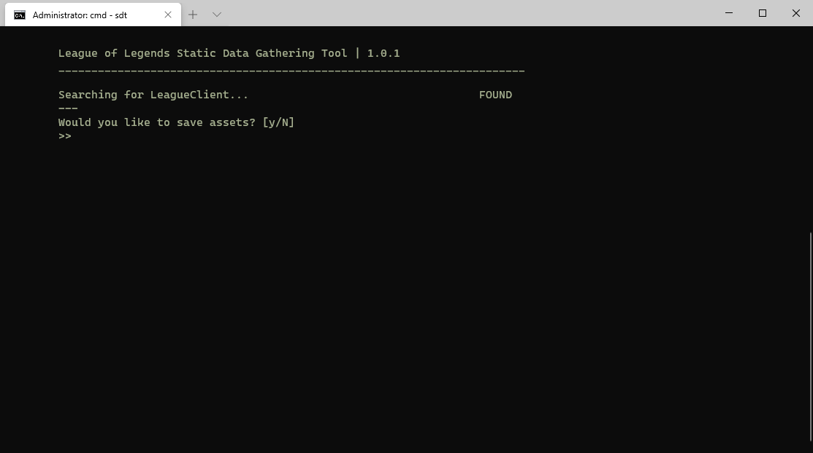

# lol-static-data
Simple tool for gathering static data from League of Legends client\
**Using League Client API**

Should be working for all regions supported by RiotGames, Garena and Tencent servers are not tested\
**A ready json file for en_GB locale is available under /static/ dir**



---

### Available Data
* Champions
* Skins
* Icons
* Wards
* Emotes
* TFT Companions
* TFT Map Skins

### Assets
* Champion Portraits
* Champion/Skin Tiles
* Icon Images
* Ward Images 
* Emote Images
* TFT Companion Images
* TFT Map Skin Images

### JSON Schema

```txt
{
  "version": "9.13.280.4632",
  "locale": "en_GB",
  "content": [
    "CHAMPIONS",
    ...
  ],
  "info": {
    "champions": 142,
    ...
  },
  "data": {
    "champions": [
      {
        "id": 1,
        "name": "Annie",
        "alias": "Annie",
        "title": "the Dark Child",
        "shortBio": "Dangerous, yet disarmingly precocious, Annie is a child mage with...",
        "squarePortraitPath": "/assets/champions/portraits/1.png",
        "roles": [
          "mage"
        ],
        "skins": [
          {
            "id": 1000,
            "name": "Annie (default)",
            "description": null,
            "rarity": "kNoRarity",
            "isLegacy": false,
            "tilePath": "/assets/champions/tiles/1000.jpg",
            "chromas": null
          },
          ...
        ]
      },
      ...
    ],
    "icons": [
      {
        "id": 0,
        "title": "Blue Minion Bruiser Icon",
        "description": "Unlocked by creating an account in League of...",
        "set": "Starter Pack",
        "yearReleased": 2009,
        "rarity": "kNoRarity",
        "isLegacy": false,
        "imagePath": "/assets/icons/0.jpg"
      },
      ...
    ],
    "wards": [
      {
        "id": 0,
        "name": "Default Ward",
        "defaultDescription": "Base Ward Skin",
        "description": "This ward was released for purchase in the...",
        "set": "Starter Pack",
        "rarity": "kNoRarity",
        "isLegacy": false,
        "imagePath": "/assets/wards/0.png"
      },
      ...
    ],
    "emotes": [
      {
        "id": 1030,
        "name": "Nice Try",
        "description": null,
        "imagePath": "/assets/emotes/1030.png"
      },
      ...
    ],
    "tftcompanions": [
      {
        "id": 1016,
        "name": "Shadowmask Hauntling",
        "description": "The spookiest of the Little Legends.",
        "species": "Hauntling",
        "level": 1,
        "imagePath": "/assets/tftcompanions/1016.png"
      },
      ...
    ],
    "tftmapskins": [
      {
        "id": 1,
        "name": "Default Arena",
        "description": null,
        "imagePath": "/assets/tftmapskins/1.png"
      },
      ...
    ]
  }
}
```
